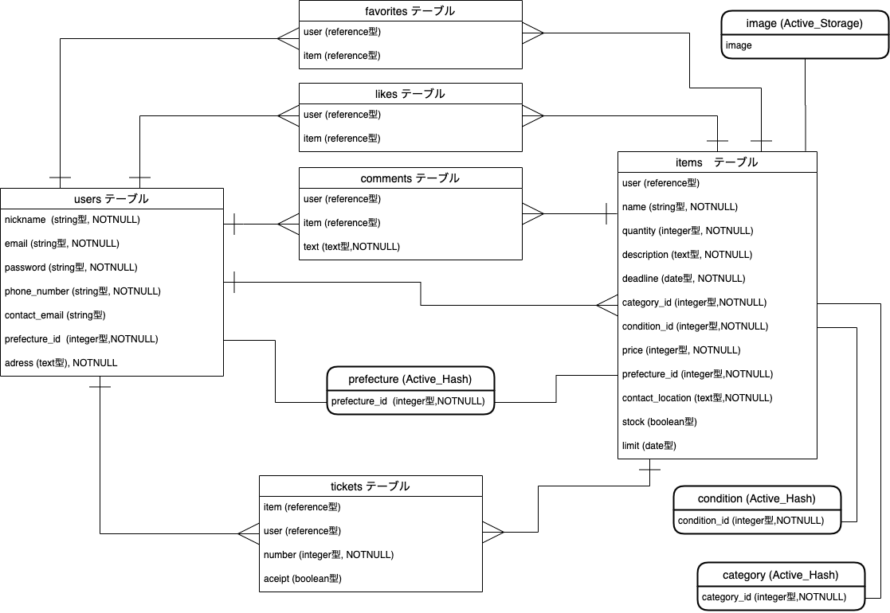

# jimoshare の ER 図

# テーブル構成

## users テーブル

| Column           | Type    | Options     |
| ---------------- | ------- | ----------- |
| nickname         | string  | null: false |
| email            | string  | null: false |
| password         | string  | null: false |
| phone_number     | string  | null: false |
| contact_email    | string  |             |
| prefecture_id    | integer | null: false |
| contact_location | text    |             |

### Association

- has_many :items
- has_many :orders
- has_many :favorites
- has_many :likes
- has_many :comments
- has_many :stocks

## items テーブル

| Column           | Type       | Options                        |
| ---------------- | ---------- | ------------------------------ |
| user             | references | null: false, foreign_key: true |
| name             | string     | null: false                    |
| quantity         | integer    | null: false                    |
| description      | text       | null: false                    |
| category_id      | integer    | null: false                    |
| condition_id     | integer    | null: false                    |
| deadline         | date       | null: false                    |
| prefecture_id    | integer    | null: false                    |
| price            | integer    | null: false                    |
| contact_location | text       | null: false                    |

### Association

- belongs_to :user
- belongs_to :stock
- has_many :favorites
- has_many :likes
- has_many :comments
- has_many :tickets

## orders テーブル

| Column | Type       | Options                        |
| ------ | ---------- | ------------------------------ |
| user   | references | null: false, foreign_key: true |
| ticket | references | null: false, foreign_key: true |

### Association

- belongs_to :user
- belongs_to :ticket

## tickets テーブル

| Column | Type       | Options                        |
| ------ | ---------- | ------------------------------ |
| item   | references | null: false, foreign_key: true |
| ticket | integer    | null: false                    |

### Association

- belongs_to :item
- has_one :orders

## favorites テーブル

| Column | Type       | Options                        |
| ------ | ---------- | ------------------------------ |
| user   | references | null: false, foreign_key: true |
| item   | references | null: false, foreign_key: true |

### Association

- belongs_to :user
- belongs_to :item

## likes テーブル

| Column | Type       | Options                        |
| ------ | ---------- | ------------------------------ |
| user   | references | null: false, foreign_key: true |
| item   | references | null: false, foreign_key: true |

### Association

- belongs_to :user
- belongs_to :item

## comments テーブル

| Column  | Type       | Options                        |
| ------- | ---------- | ------------------------------ |
| user    | references | null: false, foreign_key: true |
| item    | references | null: false, foreign_key: true |
| comment | text       | null: false                    |

### Association

- belongs_to :user
- belongs_to :item

## stocks テーブル

| Column | Type       | Options                        |
| ------ | ---------- | ------------------------------ |
| user   | references | null: false, foreign_key: true |
| limit  | date       | null: false                    |

### Association

- belongs_to :user
- has_one :item

## Active_Hash

- prefecture
- condition
- category

## Active_Storage

- image
