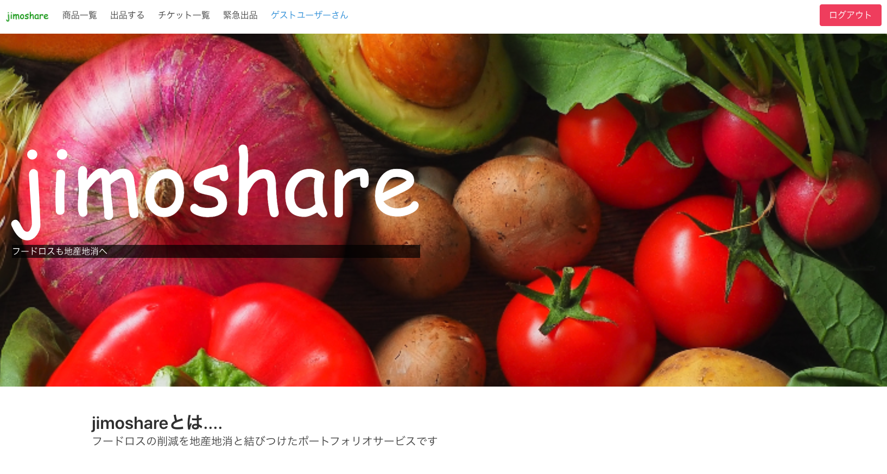
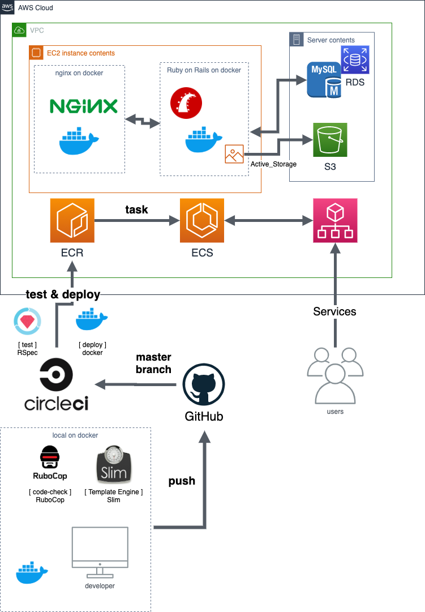

# jimoshare

[jimoshare](http://jimoshare-app-alb-1286113539.ap-northeast-1.elb.amazonaws.com/)

# 概要

## jimoshare とは



imoshare(ジモシェア)は、「フードロスも地産地消」をキャッチコピーにしたフードロス削減のためのシェアサービスです。

# jimoshare の開発環境



# 使用技術

- フレームワーク：Rails6.0.3
- フロント：Slim、Sass、JavaScript（jQuery）
- CSS フレームワーク：Bulma
- サーバーサイド言語：Ruby2.6.6
- データベース：MySQL
- テストフレームワーク：RSpec
- コードチェック：RuboCop
- サーバー：puma nginx
- ヴァージョン管理：GitHub
- CI/CD パイプライン：CircleCI
- 開発環境：local on Docker
- デプロイ環境：AWS(EC2 / ECR / ECS / RDS)
- ユーザー管理：devise
- 検索絞込み機能：ransak
- 画像投稿： Active_Storage
- 使用マシン：Mac Catalina(10.15.7)

# 目指した課題解決

#### フードロスの観点から

- 小規模食品関連工場の管理職、飲食店経営者、農家が賞味期限の近い食品や余った収穫物、食材が余ったメニューの処理に困る、廃棄してしまうという課題への解決。

#### 貧困の観点から

- 子供食堂やフードストックのボランティアに携わっている人、ペットなど余計な食品がかかってしまう人、食品不足の人へ、食品の供給が必要という課題への解決。

# メイン機能

登録したユーザーは、主に食品の出品と購入ができます。

### 商品出品機能 / ストック出品機能 / お知らせ機能

- 出品時はストック出品と直接出品があり、ストック出品時はユーザー専用画面にのみ表示され、他ユーザーが購入できない状態です。ストック出品は設定した日にお知らせ表示が行われ、商品の確認/出品がすぐ行えますので、在庫管理のように利用することが可能です。

### チケット発券機能 / 購入機能 / ナンバーチェック機能

- 購入時は商品を確認し、チケット発券を行います。チケット発券を行うと、出品ユーザーと購入ユーザーのみ確認できるチケットが発行され、実際に食品の購入や譲渡を行う際に、チェックで拡大するチケットのナンバーを照らし合わせ、出品者が受け取り処理を行うことで、取引が成立します。

# サブ機能

- ゲストログイン機能
- マイページ確認/編集機能
- 商品詳細確認機能
- 商品編集/削除機能
- 商品出品/編集時 画像プレビュー機能
- 商品名検索機能
- 商品分類絞り込み機能
- 商品並び替え機能
- 商品ブックマーク機能
- いいね機能
- コメント機能
- twitter シェア機能

## 追加実装予定

- 緊急出品機能
- 引き渡し場所の google map 利用

# jimoshare の ER 図


# テーブル構成

## users テーブル

| Column           | Type    | Options     |
| ---------------- | ------- | ----------- |
| nickname         | string  | null: false |
| email            | string  | null: false |
| password         | string  | null: false |
| phone_number     | string  | null: false |
| contact_email    | string  |             |
| prefecture_id    | integer | null: false |
| contact_location | text    |             |

### Association

- has_many :items
- has_many :orders
- has_many :favorites
- has_many :likes
- has_many :comments
- has_many :stocks

## items テーブル

| Column           | Type       | Options                        |
| ---------------- | ---------- | ------------------------------ |
| user             | references | null: false, foreign_key: true |
| name             | string     | null: false                    |
| quantity         | integer    | null: false                    |
| description      | text       | null: false                    |
| category_id      | integer    | null: false                    |
| condition_id     | integer    | null: false                    |
| deadline         | date       | null: false                    |
| prefecture_id    | integer    | null: false                    |
| price            | integer    | null: false                    |
| contact_location | text       | null: false                    |
| stock            | boolean    |                                |
| limit            | date       |                                |

### Association

- belongs_to :user
- belongs_to :stock
- has_many :favorites
- has_many :likes
- has_many :comments
- has_many :tickets

## tickets テーブル

| Column | Type       | Options                        |
| ------ | ---------- | ------------------------------ |
| user   | references | null: false, foreign_key: true |
| item   | references | null: false, foreign_key: true |
| number | integer    | null: false                    |
| aceipt | boolean    |                                |

### Association

- belongs_to :item
- belongs_to :user

## favorites テーブル

| Column | Type       | Options                        |
| ------ | ---------- | ------------------------------ |
| user   | references | null: false, foreign_key: true |
| item   | references | null: false, foreign_key: true |

### Association

- belongs_to :user
- belongs_to :item

## likes テーブル

| Column | Type       | Options                        |
| ------ | ---------- | ------------------------------ |
| user   | references | null: false, foreign_key: true |
| item   | references | null: false, foreign_key: true |

### Association

- belongs_to :user
- belongs_to :item

## comments テーブル

| Column | Type       | Options                        |
| ------ | ---------- | ------------------------------ |
| user   | references | null: false, foreign_key: true |
| item   | references | null: false, foreign_key: true |
| text   | text       | null: false                    |

### Association

- belongs_to :user
- belongs_to :item

## Active_Hash

- prefecture
- condition
- category

## Active_Storage

- image

# ローカルでの動作方法

- 起動に DockerDesktop が必要です。
- ローカル DB は port 4306 で SequelPro で接続できるようになっています。

手元にクローンします

```
$ git clone https://github.com/Y-h-tomo/jimoshare-app.git
```

Docker イメージの構築とサーバー立ち上げを行います

```
$ docker-compose up --build
```

データベース作成します

```
$ docker-compose run web bundle exec rails db:create
```

データベースを読み込みます

```
$ docker-compose run web bundle exec rails db:migrate
```

http://localhost/
でアクセス可能です。
